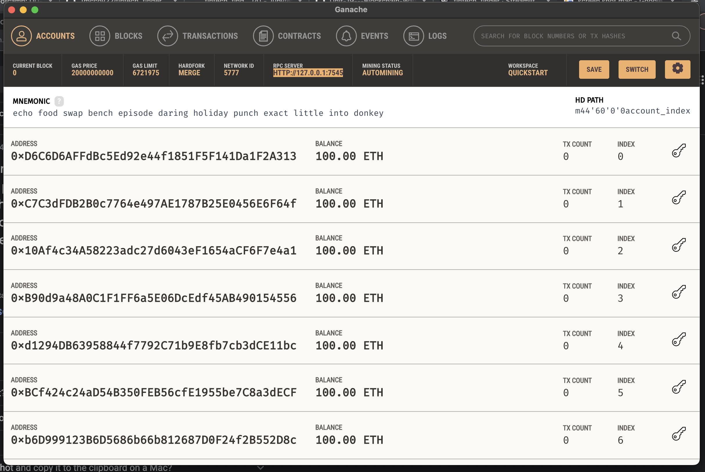
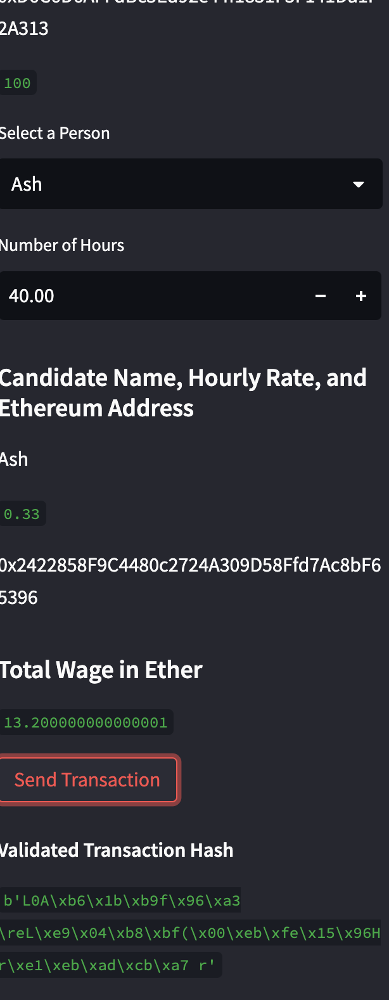

# Fintech Finder
This is a Visual Studio notebook that integrates two files that will allow you to automate the tasks associated with generating a digital wallet, accessing Ethereum account balances, and signing and sending transactions via a personal Ethereum blockchain called Ganache.  Fintech Finder is an application that its customers can use to find fintech professionals from among a list of candidates, hire them, and pay them. I have included pictures of the interface as well. 
---

## Technologies

This project leverages python 3.7 with the following packages:

* [Web3](https://github.com/web3/web3.js) - A python interface for interacting with the Ethereum blockchain and ecosystem.

* [streamlit](https://github.com/streamlit) - The fastest way to build data apps in Python. Information on github. 

* [dataclasses](https://docs.python.org/3/library/dataclasses.html) - This module provides a decorator and functions for automatically adding generated special methods

* [haslib](https://docs.python.org/3/library/hashlib.html) - This module implements a common interface to many different secure hash and message digest algorithms

* [typing](https://docs.python.org/3/library/typing.html) - This module provides runtime support for type hints.

* [Ganache](https://trufflesuite.com/ganache/) - A program that allows you to quickly set up a local blockchain, which you can use to test and develop smart contracts.

* [bip44](https://pypi.org/project/bip44/) - A Python implementation for deriving hierarchical deterministic wallets from a seed phrase based on the BIP-44 standard.

* [MNEMONIC](https://pypi.org/project/mnemonic/) - A Python implementation for generating a 12- or 24-word mnemonic seed phrase based on the BIP-39 standard.
---

## Installation Guide

Before running the application first install the following dependencies. Note that if you are running on the cloud and not locally you will have to run all lines of code.

You will need to set up a Ganache accout and run the quick start. Follow the instructions on the [Ganache](https://trufflesuite.com/ganache/) to download and install this tool on your local machine.

```
import os
import requests
from dotenv import load_dotenv
load_dotenv()
from bip44 import Wallet
from web3 import Account
from web3 import middleware
from web3.gas_strategies.time_based import medium_gas_price_strategy

import streamlit as st
from dataclasses import dataclass
from typing import Any, List
from web3 import Web3
w3 = Web3(Web3.HTTPProvider('HTTP://127.0.0.1:7545'))

```


---

## Usage

Use Visual Studio
Ganache
Streamlit

---

## Examples
```
  raw_tx = {
        "to": to,
        "from": account.address,
        "value": value,
        "gas": gasEstimate,
        "gasPrice": 586181641,
        "nonce": w3.eth.getTransactionCount(account.address)
    }

```

---

## Images

### Below are examples of the app running in Streamlit

Initial Image of Ganache


ETH confirmation based on hours


Ganache Balance updated 


Streamlit


## Contributors

DU Starter Code
Terrence McCoy


---

## License

MIT
